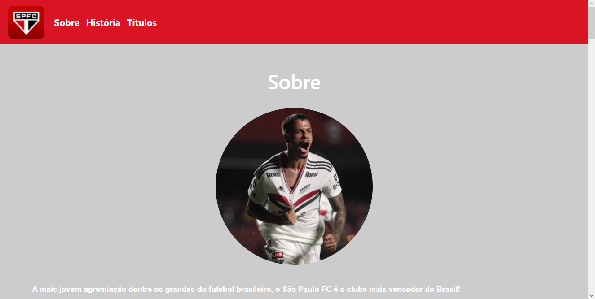
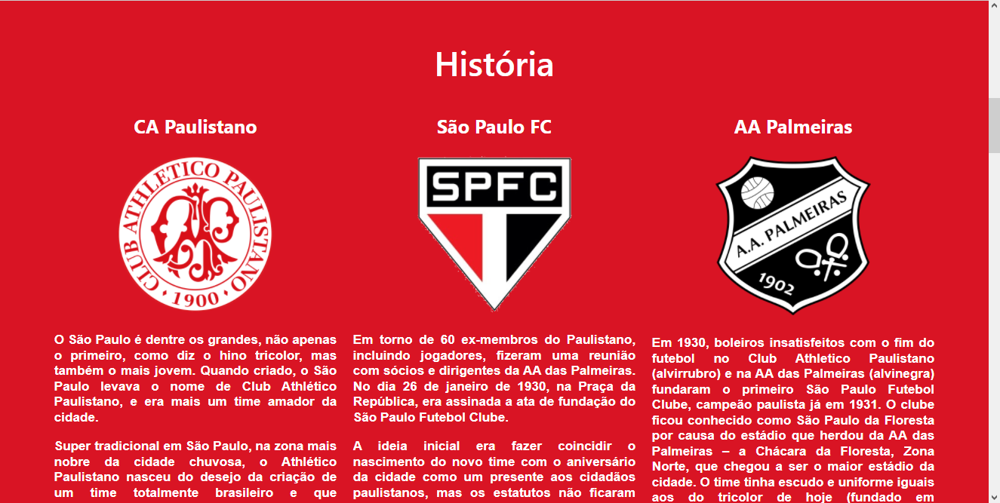
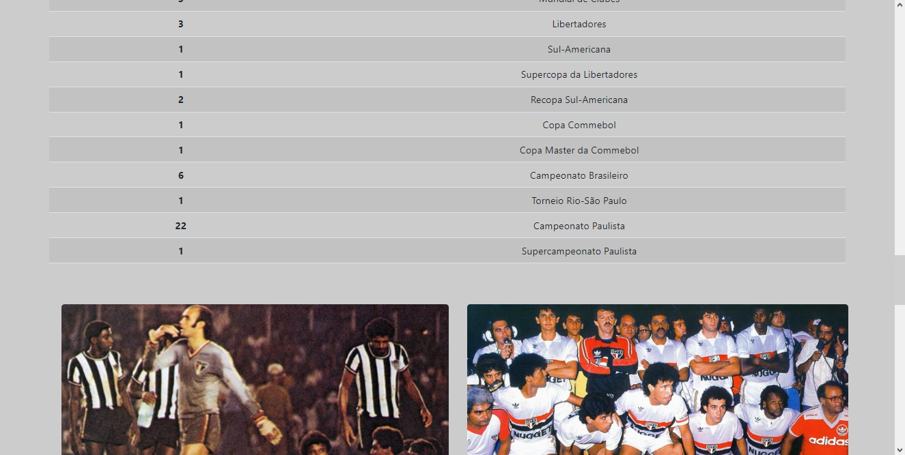

- Page responsive with bootstrap - Março 2022, por Vitor Benedito

Projeto: 

- Header:

- Section História:

- Section Títulos:

Dificuldades encontradas: 

Trabalhar alguns pontos da responsividade já pré-moldada do framework bootstrap.